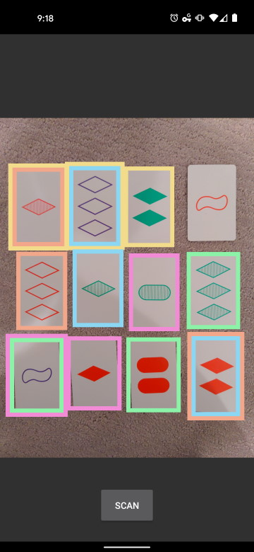

# SET Solver

Identifies sets of [SET](https://en.wikipedia.org/wiki/Set_(card_game)) cards in images.


## Use

Install preequisites into a virtual environment:
```
python3 -m venv venv
source venv/bin/activate
pip install -r requirements.txt
```

Run the solver:
```
python3 solve.py [input_filename] [output_basename]
```

## Commentary

This project is a deliberately retro approach to computer vision&mdash;no
machine learning practioners were harmed in the making of this software!
Instead, it uses domain-specific segmentation and classification techniques
built using OpenCV primitives.

Segmentation roughly follows these steps:

1. Identify line segments in the input image. Line segments are taken from
both the grayscale and HSV saturation-channel versions of the input image
because this combination seems to identify the most useful lines.

1. Build a graph of line segments connected to one another (roughly) at
90-degree angles.

1. Find 4-cycles in the connection graph to identify candidate rectangles.

1. Filter candidates for uniqueness, dimensions, etc.

1. Extract card images using a perspective transform.

Classification roughly follows these steps:

1. Flatten the card image into two colours. Separate the shape from the card
in HSV.

1. Classify the count by extracting the largest exterior contours from the
image.

1. Classify the colour by finding the nearest match to predetermined
reference colours. These reference values were calculated by finding the
average colour in the reference set of cards.

1. Classify the fill by looking at the center row of a shape and assessing
how filled/lined/empty it is.

1. Classify the SET shape by looking at the complexity and
convexity/concavity of the shape contour.

Solving is, perhaps unsurprisingly, the most straightfoward part of the whole
affair. The only novelty is that we only need to look at all pairs of cards
and determine whether the missing third card in the set is part of the game.
This operation is made vaguely more efficient by using a bit-packed
representation for the card attributes.

## Android App

This project also contains an Android app that acts as a mobile front-end to
the solver deployed on AWS as a Lambda function. This approach seemed more
tractable than rewriting the Python/OpenCV implementation. The deployment
leverages [AWS SAM](https://aws.amazon.com/serverless/sam/) to simplify and
automate packaging the solver into a Docker container and hosting it via
Lambda and API Gateway.

